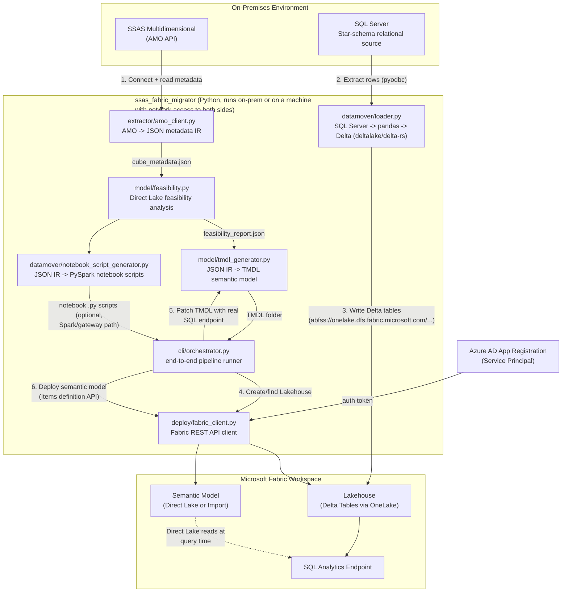

# SSAS Multidimensional (MDX) Cube → Microsoft Fabric Migration Tool

A code-based accelerator that migrates an on-premises **SQL Server Analysis
Services (SSAS) Multidimensional** cube to **Microsoft Fabric**, producing a
Direct Lake (or Import, with documented reasons) Power BI semantic model
backed by Delta tables in a Fabric Lakehouse.

---

## 1. Purpose / Objective

Organizations with legacy SSAS Multidimensional (MDX) cubes need a
repeatable, low-risk path to Microsoft Fabric. Rebuilding a semantic model
by hand is slow and error-prone (measures, hierarchies, relationships, and
data types must all be re-derived correctly from the cube). This tool
automates that process end-to-end:

1. **Extracts** the full metadata of a running SSAS Multidimensional cube
   (dimensions, attributes, hierarchies, measure groups, measures,
   relationships, calculated members, KPIs, data source/DSV schema) via the
   AMO (Analysis Management Objects) API.
2. **Analyzes** the extracted metadata against known Microsoft Fabric
   **Direct Lake** constraints and recommends Direct Lake or Import mode
   *per cube*, with specific, itemized reasons for any fallback.
3. **Generates**:
   - A TMDL (Tabular Model Definition Language) semantic model folder,
     with tables, columns, relationships, DAX measures (translated from MDX
     aggregation functions), and hierarchies.
   - Fabric notebook (PySpark) scripts that create/refresh the equivalent
     Delta tables, for teams who want a Spark-based, gateway/mirroring-fed
     load path.
4. **Migrates data**: extracts the underlying star-schema tables from the
   on-premises relational source and writes them directly as Delta tables
   into a Fabric Lakehouse via OneLake (no Spark cluster, gateway, or
   mirroring required for this path).
5. **Deploys**: creates/updates the Lakehouse and the Semantic Model items
   in a target Fabric workspace via the Fabric REST API, using a service
   principal (unattended, repeatable automation).

The tool is **generic** — it is not hard-coded to any one cube. Point it at
any SSAS Multidimensional server/database connection string and it will
extract and convert that cube's structure.

---

## 2. Architecture



**Key design decisions:**

- **No Spark/gateway dependency for automated data movement.** The
  `datamover/loader.py` module writes Delta tables directly to OneLake's
  ADLS Gen2-compatible endpoint using the `deltalake` (delta-rs) Python
  library. This avoids requiring an On-premises Data Gateway or Fabric
  mirroring to be configured, at the cost of running the extraction from a
  machine that has network line-of-sight to both the on-prem SQL Server and
  the internet (for OneLake).
- **AMO (not DMVs)** is used for metadata extraction, for full object-model
  fidelity (partitions, storage modes, granularity attributes, DSV schema)
  that DMV/XMLA discovery alone does not always expose cleanly.
- **TMDL** (not TMSL/.bim) is the generation target because it is the
  format natively accepted by the Fabric "create/update item definition"
  REST API and is human-readable/diffable in source control.
- **Service principal auth** (not delegated/user auth) so the pipeline can
  run unattended and repeatably (e.g., from a CI/CD pipeline in the future).

---

## 3. Prerequisites (one-time environment setup)

| # | Prerequisite | Why | How to verify |
|---|---|---|---|
| 1 | Windows machine with network access to **both** the on-prem SSAS/SQL Server **and** the internet (for Fabric/OneLake) | The tool bridges the two directly; no gateway is used | `Test-NetConnection <SSAS host>` and `Test-NetConnection onelake.dfs.fabric.microsoft.com -Port 443` both succeed |
| 2 | **x64 Python 3.10+** (not ARM64 - see [Limitations](#6-limitations)) | `pyarrow`, `cryptography`, `deltalake` do not ship ARM64 Windows wheels at the time of writing | `python -c "import platform; print(platform.machine())"` prints `AMD64` |
| 3 | SQL Server **AMO** client library installed (installed automatically with SSMS or the SQL Server Feature Pack) | `extractor/amo_client.py` loads `Microsoft.AnalysisServices.dll` via `pythonnet` | `Get-ChildItem "C:\Program Files\Microsoft SQL Server" -Recurse -Filter "Microsoft.AnalysisServices.dll"` returns a path |
| 4 | Windows account used to run the extractor is a recognized **Analysis Services Server Administrator** (or the extractor is run from an elevated/admin session) | AS only lists/serves databases to identities it recognizes as admins | Connecting via SSMS (same account, same elevation) shows the target database under the AS server |
| 5 | ODBC Driver 17 or 18 for SQL Server installed | `datamover/loader.py` uses `pyodbc` to read the relational source | `python -c "import pyodbc; print(pyodbc.drivers())"` lists `ODBC Driver 18 for SQL Server` |
| 6 | An Azure AD **App Registration (service principal)** with a client secret | Used for all Fabric REST API calls | See step-by-step in [Section 4, Step 0](#step-0-one-time-fabric--service-principal-setup) |
| 7 | Fabric tenant setting **"Service principals can use Fabric APIs"** enabled, scoped to a security group containing the SP | Fabric blocks app-only calls by default | Fabric Admin Portal → Tenant settings → Developer settings |
| 8 | The service principal added as **Contributor** (or higher) on the target Fabric **workspace** | Needed to create Lakehouse/Semantic Model items | Workspace → Manage access → confirm the SP is listed |
| 9 | The target Fabric workspace is on a **Fabric capacity** (not a Power BI Pro-only workspace) | Direct Lake and Lakehouse items require a Fabric capacity | Workspace settings show a Fabric capacity assigned |

---

## 4. Step-by-Step Usage

### Step 0: One-time Fabric + service principal setup

**Where:** Any machine, run as a user with **Global Administrator** or
**Application Administrator** rights in Entra ID (Azure AD).

```powershell
az login --tenant <TENANT_ID>
az ad app create --display-name "SSAS-Fabric-Migration-SP" --sign-in-audience AzureADMyOrg
# note the appId from the output
az ad sp create --id <appId>
az ad app credential reset --id <appId> --append --display-name "migration-tool-secret" --years 1
# SAVE the printed "password" value immediately - it is shown only once
```

Then, in the **Fabric Admin Portal** (`https://app.fabric.microsoft.com/admin-portal/tenantSettings`):
1. Developer settings → enable **"Service principals can use Fabric APIs"**,
   scoped to a security group containing the new SP.
2. In the target **workspace** → Manage access → Add the SP as **Contributor**.

**Validate:** the app registration, its secret, and its workspace role all
exist; you have the Tenant ID, Client ID, Client Secret, and Workspace ID in
hand.

Copy `config/.env.template` to `config/.env` and fill in:

```
FABRIC_TENANT_ID=...
FABRIC_CLIENT_ID=...
FABRIC_CLIENT_SECRET=...
FABRIC_WORKSPACE_ID=...
SSAS_SERVER=<host>\<instance>
SSAS_DATABASE=<cube database name>
SQL_SERVER=<relational source server>
SQL_DATABASE=<relational source database>
```

`config/.env` is git-ignored - never commit it.

**Install dependencies** (use the x64 Python interpreter):

```powershell
<path-to-x64-python>\python.exe -m pip install -r requirements.txt
```

---

### Step 1: Extract cube metadata

**Where:** On a machine that can connect to the SSAS server (elevated
session if your account is not already an AS admin - see prerequisite 4).

```powershell
python -m ssas_fabric_migrator.extractor.amo_client `
  --server "<host>\<instance>" --database "<cube database>" `
  --output "output\cube_metadata.json"
```

**Validate success:**
- Command prints `Wrote metadata IR to output\cube_metadata.json`.
- Open the JSON and confirm `dimensions`, `cubes[0].measure_groups`, and
  `data_source_views` are populated (not empty arrays) and table/column
  names match your source schema.
- If you instead get "Database ... not found", your session is not
  recognized as an AS admin - rerun elevated, or add your account as an AS
  Server Administrator via SSMS (Object Explorer → server → Properties →
  Security).

---

### Step 2: Direct Lake feasibility analysis

**Where:** Anywhere (no live connections needed - operates on the JSON from
Step 1).

```powershell
python -m ssas_fabric_migrator.model.feasibility `
  --input "output\cube_metadata.json" --output "output\feasibility_report.json"
```

**Validate success:**
- Console prints, per cube, a `Recommended mode` (`DirectLake` or `Import`)
  and a list of findings tagged `[BLOCKING]`, `[WARNING]`, or `[INFO]`.
- Read every `[BLOCKING]` finding - these are the reasons Import mode was
  chosen instead of Direct Lake (e.g., non-MOLAP partitions, missing
  granularity attributes). Read every `[WARNING]` - these do not block
  Direct Lake but need manual DAX authoring (semi-additive measures,
  many-to-many relationships, MDX calculated members/KPIs, suspected
  parent-child hierarchies).

---

### Step 3: Generate the semantic model (TMDL) + Delta table scripts

**Where:** Anywhere (operates on the JSON from Steps 1-2).

```powershell
python -m ssas_fabric_migrator.model.tmdl_generator `
  --metadata "output\cube_metadata.json" --feasibility "output\feasibility_report.json" `
  --output "output\SemanticModel"

python -m ssas_fabric_migrator.datamover.notebook_script_generator `
  --metadata "output\cube_metadata.json" --output "output\notebooks"
```

**Validate success:**
- `output\SemanticModel\definition\tables\*.tmdl` exists for every
  dimension + fact table, each with `column`, `measure` (fact table only),
  `hierarchy` (where applicable), and a `partition ... mode: directLake` (or
  `import`) block.
- Open a generated `.tmdl` file and manually verify measure DAX expressions
  look correct for your cube's aggregation functions (`SUM`, `COUNTROWS`,
  etc.) - **anything with a `/* TODO: manual DAX translation required */`
  comment must be hand-authored** before relying on that measure.
- If the cube had calculated members or KPIs, confirm
  `output\SemanticModel\definition\MANUAL_TRANSLATION_REQUIRED.tmdl` was
  created and lists them (these are never auto-translated - see
  [Limitations](#6-limitations)).
- `output\notebooks\create_<table>.py` exists per table (optional
  Spark-based load path; only needed if you plan to feed the Lakehouse via
  gateway/mirroring + notebook instead of the automated path in Step 5).

---

### Step 4: Create/verify the target Lakehouse and patch the model's connection

**Where:** Anywhere with internet access + `config/.env` populated (Step 0).

```powershell
python -m ssas_fabric_migrator.cli.orchestrator --steps "deploy-lake" --env-file "config\.env" --lakehouse-name "<LakehouseName>"
```

**Validate success:**
- Console prints the Lakehouse id and a **non-null** SQL analytics
  endpoint. If the endpoint prints as `None`, wait ~30 seconds and rerun -
  Fabric provisions the SQL endpoint asynchronously right after Lakehouse
  creation.
- In the Fabric portal, the Lakehouse item appears in the target workspace.
- `output\SemanticModel\definition\expressions.tmdl` no longer contains the
  literal string `TODO_SET_LAKEHOUSE_SQL_ENDPOINT`.

---

### Step 5: Migrate data (on-prem SQL Server → Fabric Lakehouse Delta tables)

**Where:** The same machine as Step 1 (needs on-prem SQL Server access) with
internet access to OneLake.

```powershell
python -m ssas_fabric_migrator.cli.orchestrator --steps "migrate-data" --env-file "config\.env" --lakehouse-name "<LakehouseName>"
```

**Validate success:**
- Console prints, per table, `<table>: <N> rows -> abfss://.../Tables/<table>`.
- Compare `<N>` against a manual `SELECT COUNT(*)` against the source table.
- In the Fabric portal, open the Lakehouse → Tables and confirm each table
  is listed with the same row count and a "Delta" icon.
- Optionally, use the Lakehouse SQL analytics endpoint to run
  `SELECT TOP 10 * FROM <table>` and spot-check values.

---

### Step 6: Deploy the semantic model

**Where:** Anywhere with internet access + `config/.env` populated.

```powershell
python -m ssas_fabric_migrator.cli.orchestrator --steps "deploy-model" --env-file "config\.env" --semantic-model-name "<ModelName>"
```

**Validate success:**
- Command completes without raising `Fabric operation failed: ...`.
- The Semantic Model item appears in the target workspace in the Fabric
  portal.
- Open the model and run a quick DAX query / build a visual referencing a
  fact measure and a dimension attribute; confirm the totals match a
  known-good query against the original cube (e.g., an MDX query against
  the SSAS cube for the same measure).
- If the model was recommended for **Direct Lake**, confirm in the model's
  settings that storage mode is indeed Direct Lake (not Import) and that it
  reflects new data immediately after a change to the Lakehouse tables
  (no manual refresh needed). If it was recommended for **Import**, a
  scheduled/manual refresh is required to pick up new data - configure this
  separately in the Fabric portal.

### Running the whole pipeline at once

Once Step 0 is complete, all of Steps 1-6 can be run together:

```powershell
python -m ssas_fabric_migrator.cli.orchestrator `
  --steps "extract,analyze,generate,deploy-lake,migrate-data,deploy-model" `
  --env-file "config\.env" `
  --lakehouse-name "<LakehouseName>" `
  --semantic-model-name "<ModelName>"
```

---

## 5. Repository Structure

```
ssas_fabric_migrator/
  extractor/amo_client.py          Step 1 - AMO metadata extraction
  model/feasibility.py             Step 2 - Direct Lake feasibility analysis
  model/tmdl_generator.py          Step 3 - TMDL semantic model generation
  datamover/loader.py              Step 5 - SQL Server -> Delta table writer
  datamover/notebook_script_generator.py   Step 3 - optional PySpark scripts
  deploy/fabric_client.py          Steps 4/6 - Fabric REST API client
  cli/orchestrator.py              Chains all steps via one command
config/.env.template               Copy to .env and fill in (git-ignored)
demo-cube-setup/                   Reference: SQL + AMO scripts used to build
                                    the sample on-prem cube this tool was
                                    validated against (not required to use
                                    the tool itself)
requirements.txt
```

---

## 6. Limitations

- **Windows ARM64 is not supported for running the tool itself.** `pyarrow`,
  `cryptography`, and `deltalake` have no prebuilt wheels for Windows ARM64
  as of this writing, and there is no Rust/C toolchain assumed to build them
  from source. Run the tool with an x64 Python interpreter (works fine under
  Windows-on-ARM x64 emulation).
- **MDX calculated members and KPIs are never auto-translated to DAX.** MDX
  and DAX are not mechanically equivalent languages; an automatic
  translation would risk silently producing incorrect numbers. These are
  extracted and listed (with their original MDX text) in
  `MANUAL_TRANSLATION_REQUIRED.tmdl` for a human to hand-author as DAX
  measures.
- **Parent-child hierarchies are flagged, not converted.** Direct Lake does
  not support the `PATH()`-based calculated columns Tabular normally uses
  for parent-child; this requires precomputing the hierarchy path as a
  physical column in the Lakehouse table, which is a data-modeling decision
  this tool does not make on your behalf.
- **Semi-additive aggregations** (`AverageOfChildren`, `ByAccount`,
  `FirstChild`/`LastChild`, `FirstNonEmpty`/`LastNonEmpty`) have no direct
  DAX aggregation function equivalent; they are flagged as warnings and
  require a hand-written `CALCULATE` + time-intelligence DAX pattern.
- **Many-to-many measure group dimension relationships** are flagged for
  manual review; the required bridge table must be materialized as its own
  Delta table, which this tool does not currently automate.
- **No on-premises Data Gateway or Fabric Mirroring integration.** Data
  movement is done by directly extracting rows via `pyodbc` and writing
  Delta files to OneLake from the machine running the tool. This machine
  must have network access to both the source SQL Server and the internet.
  For very large fact tables, this single-machine, in-memory
  (`pandas`/`pyarrow`) approach will not scale as well as a
  gateway-fed Fabric pipeline or Spark-based load - use the generated
  notebook scripts (Step 3) as a starting point for that path instead if
  data volumes are large.
- **One semantic model per cube, one measure group per cube assumed** in
  the current TMDL generator. Cubes with multiple measure groups (multiple
  fact tables) will need the generator extended to emit multiple fact
  tables/relationship sets - not yet implemented.
- **ROLAP and write-back partitions** are treated as blocking for Direct
  Lake (falls back to Import) because they imply the source is not a simple
  queryable table snapshot; no automated ETL redesign is attempted for
  these.
- **Row-Level Security (RLS)/roles defined on the SSAS cube are not
  migrated.** Fabric/Power BI RLS uses a different security model (DAX
  filter expressions per role) and must be re-authored manually.
- **Validated against one demo cube** (a 3-dimension, 1-fact-table retail
  star schema with only `Sum`/`Count` measures, no calculated members, no
  KPIs, no parent-child hierarchies). Larger/more complex production cubes
  should be run through Step 2 (feasibility analysis) carefully, and the
  generated TMDL reviewed before being treated as production-ready.
